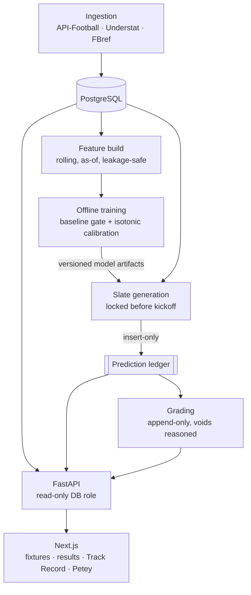

# Futbol Modelo

A calibrated soccer prediction system — real predictions, locked before
kickoff, graded automatically, published honestly (misses included).

**Live site:** [futbol.josephbernal.com](https://futbol.josephbernal.com)
**How it works:** [futbol.josephbernal.com/how-it-works](https://futbol.josephbernal.com/how-it-works)
**Track record:** [futbol.josephbernal.com/track-record](https://futbol.josephbernal.com/track-record)

## What this is

A full-stack ML system that makes predictions before matches are played,
records them somewhere it cannot edit them, and publishes how they turned out.

**Predicting now:** MLS, Premier League, Serie A.
**Ingested but not yet predicting:** La Liga — the data is loaded, but it is
missing the count stats the props models need, so no slate is generated for it
yet. The World Cup module ran through the 2026 tournament and is now marked
complete on the site.

- **Dixon-Coles** for match markets — win/draw/loss, total goals,
  both-teams-to-score — fitted per league with time decay and the low-score
  correction, plus a measured prior so newly promoted teams can be rated
  before they have any top-flight history.
- **Calibration on every published market.** Corners and shots on target are
  calibrated on out-of-fold predictions; 1X2, total goals and BTTS on a
  walk-forward backtest. Both must beat the uncalibrated version on held-out
  data or they are not saved.
- **LightGBM** for team count markets — corners and shots on target. Each is
  trained offline, calibrated with isotonic regression on out-of-fold
  predictions, and **must beat a naive baseline on a held-out period or it is
  not saved and not registered**. The training run exits non-zero when a model
  fails, so a scheduled retrain fails loudly rather than quietly leaving the
  previous model in place.
- **Player markets** — anytime goalscorer and goalkeeper saves — currently
  ship without that gate or calibrator. See Known limitations.
- An **immutable prediction ledger.** Once a prediction is written it cannot
  be edited or deleted, by anyone, including the system itself. This is
  enforced by database triggers and
  [pinned by tests](tests/test_ledger_integrity.py) that try to violate it.
- Every prediction records **which model version produced it** and **how long
  before kickoff it was locked**, both shown on the site.

## Honesty mechanics

The claim this project actually makes is not "these predictions are good", it
is "these are the predictions, unedited, and here is how they did". A few
things exist specifically to keep that true:

- **Predictions are insert-only.** A `BEFORE UPDATE OR DELETE` trigger raises
  unconditionally. Grading lives in a separate append-only table, so grading a
  prediction never touches it.
- **Locking is enforced, not promised.** A second trigger rejects any
  prediction whose `locked_at` is at or after kickoff.
- **Small samples are labelled everywhere.** One shared component, one
  threshold, applied identically on Track Record and in Petey's answers.
- **Voids are published, not hidden.** A prediction whose outcome cannot be
  determined — most often a named player who never took the field — is voided
  by fixed rule with the reason recorded, and the counts are shown on Track
  Record. Voiding is the one operation that can remove a prediction from the
  published rates, so it is automatic, reasoned, and never manual.
- **Finished competitions stay in the record**, labelled complete rather than
  removed. Dropping a concluded competition would select the record on the
  basis of how it went.

## Known limitations

Things that are true but not yet good. Listed because a track record you can
trust requires knowing what it does not cover.

- **Match-market calibration is fit on a backtest, not on the ledger.** 1X2,
  total goals and BTTS are calibrated, but the calibrator is trained by
  replaying history — fitting Dixon-Coles on matches before a block and
  predicting that block — because the ledger does not yet hold enough graded
  match predictions to calibrate against directly. Those are honest
  out-of-sample predictions, but they are not the same thing as measuring the
  live system against its own record. That check gets stronger as the ledger
  grows.
- **Roughly one in four player-market predictions voids** because the named
  player does not feature. Selection uses recent shot volume with no view of
  rotation, injury or suspension, so the market advertises more coverage than
  it delivers. A minutes-projection model is the fix.
- **MLS has no xG.** The data tier does not supply it, so the props models
  train without xG across all leagues. Measured: dropping it costs roughly
  0.002 logloss on European holdout rows, while including it excluded every
  MLS row from training entirely.
- **Promoted teams use a prior, not a rating**, until they have played. The
  prior is derived from how previously promoted sides actually performed, but
  it is a population estimate applied to an individual team.
- **The Kubernetes manifests are not the live scheduler.** The pipeline
  currently runs from a scheduled shell script. `k8s/` reflects where it is
  going, not where it runs today.

## Petey

A conversational layer on top of the real data — not a general chatbot, a
narrow tool that answers specific questions using real, pre-validated queries.
The LLM (a small local Ollama model) never writes SQL and never sees raw
database rows; it only ever phrases a pre-computed, validated answer as a
sentence, and its output is discarded if it editorializes beyond what the
numbers support. Full reasoning in [`docs/petey-spec.md`](docs/petey-spec.md)
and the decision records in
[`docs/adr/petey-decisions.md`](docs/adr/petey-decisions.md).

## Architecture



- `src/` — ingestion, entity resolution, models (Dixon-Coles, props)
- `scripts/` — training, slate generation, grading, automation entry points
- `api/` — FastAPI backend, read-only DB role, Ollama integration for Petey
- `web/` — Next.js frontend
- `sql/` — schema, migrations, views, diagnostics
- `k8s/` — Kubernetes manifests
- `docs/` — design specs and architectural decision records

## Testing

93 tests, run on every push. Unit tests cover the grading semantics and the
probability invariants; integration tests build the real schema against a
throwaway Postgres and verify the guarantees by trying to break them — that
predictions cannot be updated or deleted, that a prediction locked at kickoff
is rejected, that voiding follows its rules at the boundary.

```bash
pip install -r requirements-dev.txt
pytest                                   # unit tests
FUTBOL_TEST_DSN="host=... dbname=..." pytest   # plus integration
```

## A few real engineering notes

This project has a real, sometimes messy build history, including bugs that
were live in production before they were found.

A unique constraint on team names never enforced anything, because Postgres
treats `NULL`s as distinct and the upsert relied on it. The same mistake then
happened a second time, in the prediction ledger itself — the natural key
behind the slate generator's `ON CONFLICT` contained nullable columns, so it
had never suppressed a single duplicate. It was caught by writing a test that
expected it to work.

A calibration layer was built to fix a confirmed overconfidence problem, was
correct, and never ran: the module was not imported by the code path that
shipped, which kept writing raw uncalibrated probabilities. The fix was not
finished until it was in the path that runs.

A trigger function read from an unqualified table name, so it resolved against
the caller's `search_path` rather than the schema's, and would have failed on
any fresh deployment. The model could also emit negative probabilities,
because the likelihood clipped a term the prediction step then applied
unclipped.

There was also an LLM that read a stated confidence percentage as a literal
event count, and a Next.js client component trying to reach a
Kubernetes-internal service name no browser could resolve.

The `docs/` folder and the git history reflect that honestly. The interesting
parts of building something real usually aren't the parts that worked first
time.

## Stack

Python, PostgreSQL, LightGBM, scikit-learn, FastAPI, Next.js, TypeScript,
Tailwind, Kubernetes, Ollama.

---

An analytics project, not a wagering tool. No tips, no affiliate links.
